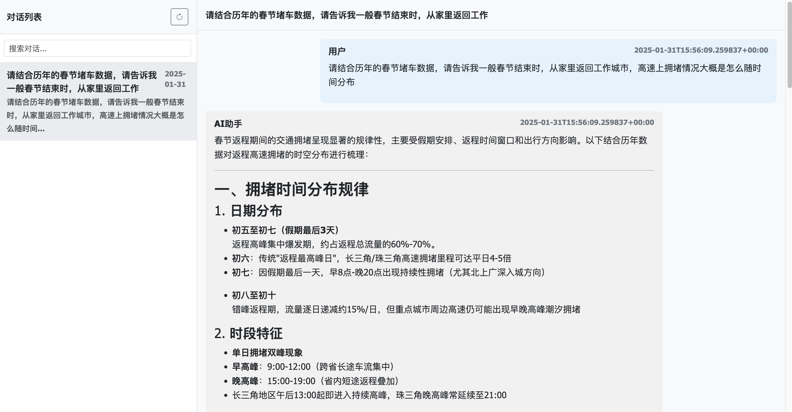

# deepseek_records_json_viewer

A python app to view the json records file which dumped from deepseek websit. 
Parsed content will be displayed as a html file, it can be viewed in chrome.

适用html的形式查看从deepseek导出的记录文件。本程序适用deepseek辅助开发，非常丝滑。

使用步骤：

1. 进入`html_viewer_v2`目录
2. 执行`deepseek_viewer_by_html_v2.py`
3. 访问terminal中提示的本地地址，即可看到如下界面

